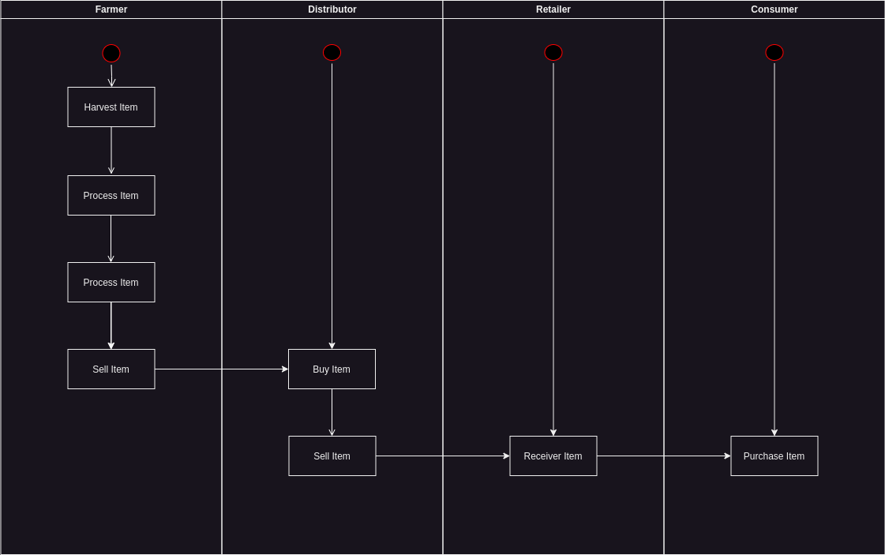
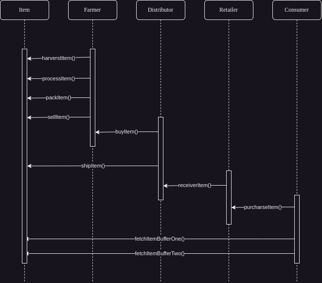
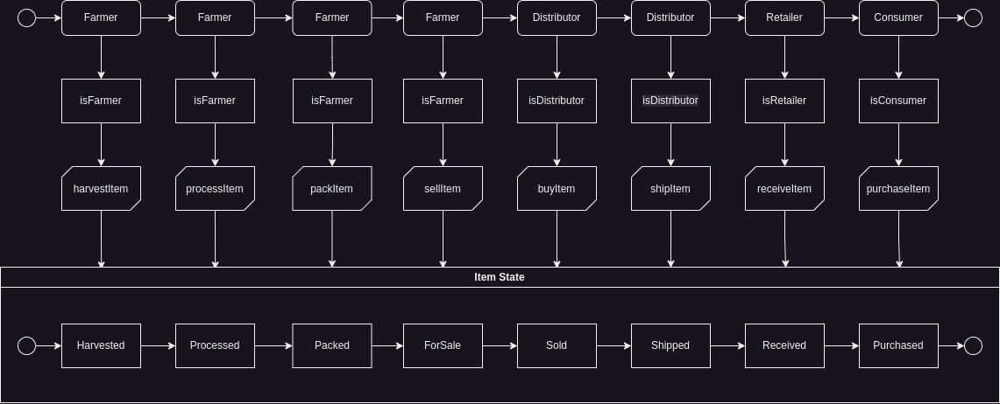
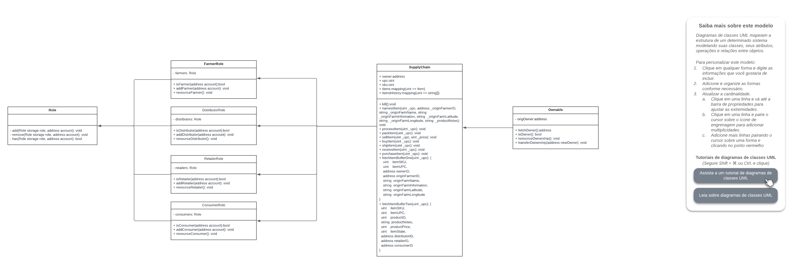

# Sepolia Info

Transaction Hash: 0xc899b688b921e4447ecb21392d13e246d4b9cb500b98555226ec5f3b209cc886

Contract address: 0x6c176EEDD0325D6DdFCdCF2cB1e6FE440f26115A

# Libraries
* ganache-cli@6.12.2 - Necessary to up local blockchain for local development 
* truffle@4.1.14 - Necessary to compile and make deploy smart contracts in networks
* web3@4.0.3 - Necessary to integrate blockchain environment with others systems
* @truffle/hdwallet-provider@2.1.13 - Necessary to connect with wallet
* lite-server@2.4.0 - Necessary to up frontend

# UML
## Activity Diagram


## Sequence Diagram


# State Diagram


# Data Model Diagram



# Supply chain & data auditing

This repository containts an Ethereum DApp that demonstrates a Supply Chain flow between a Seller and Buyer. The user story is similar to any commonly used supply chain process. A Seller can add items to the inventory system stored in the blockchain. A Buyer can purchase such items from the inventory system. Additionally a Seller can mark an item as Shipped, and similarly a Buyer can mark an item as Received.

The DApp User Interface when running should look like...


## Getting Started

These instructions will get you a copy of the project up and running on your local machine for development and testing purposes. See deployment for notes on how to deploy the project on a live system.

### Usage

```
npm install
```

Launch Ganache:

```
npm run server
```

Your terminal should look something like this:


In a separate terminal window, Compile smart contracts:

```
npm run compile
```

Your terminal should look something like this:


This will create the smart contract artifacts in folder ```build\contracts```.

Migrate smart contracts to the locally running blockchain, ganache-cli:

```
npm run migrate
```

Your terminal should look something like this:


Test smart contracts:

```
npm run test
```

All tests should pass.


In a separate terminal window, launch the DApp:

```
npm run dev
```

## Built With

* [Ethereum](https://www.ethereum.org/) - Ethereum is a decentralized platform that runs smart contracts
* [IPFS](https://ipfs.io/) - IPFS is the Distributed Web | A peer-to-peer hypermedia protocol
to make the web faster, safer, and more open.
* [Truffle Framework](http://truffleframework.com/) - Truffle is the most popular development framework for Ethereum with a mission to make your life a whole lot easier.


## Authors

See also the list of [contributors](https://github.com/your/project/contributors.md) who participated in this project.

## Acknowledgments

* Solidity
* Ganache-cli
* Truffle
* IPFS

